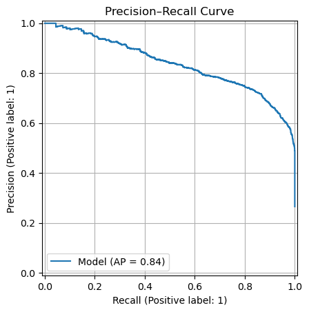
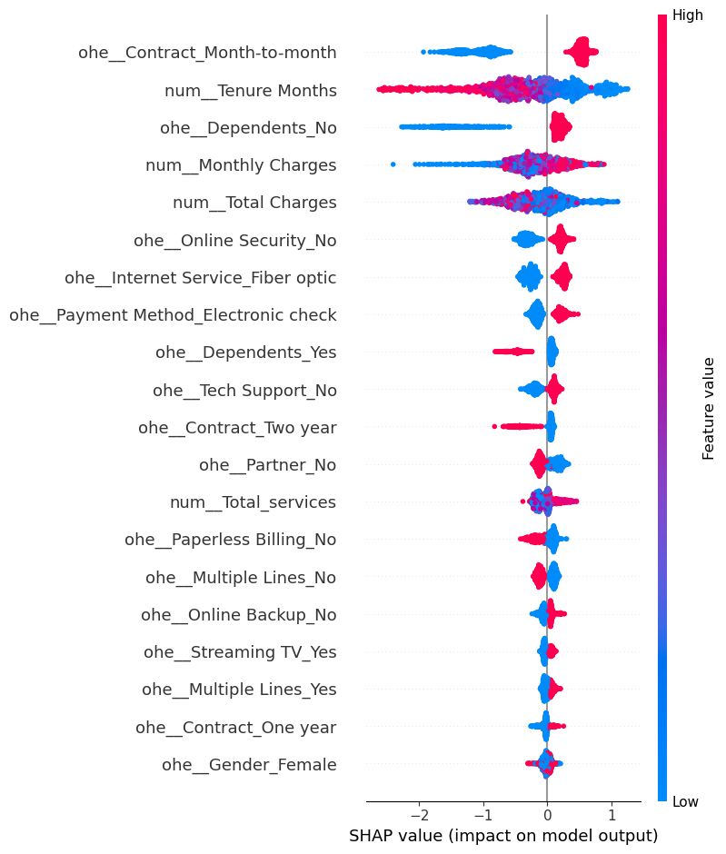

# Customer Churn Prediction — Telecom (IBM Dataset)

Supervised binary classification project predicting customer churn using hypothesis-driven EDA, separate preprocessing pipelines, threshold optimization, and SHAP explainability.

**Dataset:** [IBM Telco Customer Churn — Kaggle](https://www.kaggle.com/datasets/yeanzc/telco-customer-churn-ibm-dataset) — 7,043 customers, 33 features  
**Class distribution:** ~26% churned / ~74% active  
**Class imbalance handling:** Stratified train/test split to preserve distribution; threshold tuning to optimize F1 rather than accuracy.  
**Success criteria:** Maximize recall (catch true churners) while maintaining precision sufficient for actionable retention campaigns.

---

## Project Highlights
- Hypothesis-driven EDA — features explored by business context group with explicit hypotheses, not blindly
- Data leakage prevention — post-outcome variables explicitly identified and excluded
- Separate preprocessing pipelines for linear and tree-based models
- Threshold optimization via F1-score maximization
- SHAP explainability confirming alignment between model behavior and business intuition
- Honest evaluation — no result inflation via synthetic sample injection; generalization gap openly reported

---

## 1. Dataset

**Source:** [IBM Telco Customer Churn — Kaggle](https://www.kaggle.com/datasets/yeanzc/telco-customer-churn-ibm-dataset)  
**Size:** 7,043 customers, 33 features  
**Target:** `Churn Label` — binary (Yes/No)

| Category | Features |
|---|---|
| Demographics | Gender, Senior Citizen, Partner, Dependents |
| Services | Internet, Security, Backup, Streaming, Support |
| Contract & Billing | Contract type, Payment method, Monthly/Total charges |
| Tenure | Tenure Months |

**Dropped features:**

| Feature(s) | Reason |
|---|---|
| `Churn Value`, `Churn Reason`, `Churn Score`, `CLTV` | Post-outcome / model-derived — data leakage |
| `CustomerID`, `Count` | Identifier / zero variance |
| `Country`, `State` | No variability (all records: US, California) |
| `City`, `Zip Code`, `Lat`, `Long` | High cardinality, no churn signal beyond density |
| `Gender` | No meaningful association with churn |

---

## 2. Methodology

### 2.1 Data Split
Stratified train/test split — preserves ~26% churn rate across both sets.  
No group-based splitting needed: all CustomerIDs are unique.

### 2.2 Hypothesis-Driven EDA

Features explored by business context group. Each group had an explicit hypothesis before inclusion/exclusion decisions.

| Feature Group | Hypothesis | Outcome |
|---|---|---|
| Demographics | Stable households churn less | Partially supported — dependents ✓, gender ✗ |
| Tenure | Longer tenure → lower churn | Supported |
| Services | More services → lower churn | Non-linear — partial engagement shows highest churn |
| Contract & Billing | Month-to-month + high charges → higher churn | Strongly supported |

---

## 3. Feature Engineering & Preprocessing

Two separate pipelines — linear and tree-based models have different preprocessing requirements.

### Pipeline A — Linear Models (Logistic Regression)
- Drop irrelevant/leakage features
- Impute missing `Total Charges` (blank strings → NaN → median)
- Engineer `total_services` (sum of actively subscribed services)
- Log-transform skewed numerical features
- One-hot encode categoricals
- StandardScaler on numerical + engineered features

### Pipeline B — Tree-Based Models (Random Forest, XGBoost)
- Same drop + impute + engineer steps
- One-hot encode categoricals
- **No scaling** — tree-based models are scale-invariant

**Why separate pipelines?** Applying scaling to tree-based models adds complexity with no benefit. Keeping pipelines separate avoids silent preprocessing errors and makes model-specific assumptions explicit.

---

## 4. Modeling

Progressive complexity: Logistic Regression (baseline) → Random Forest → XGBoost.  
Threshold tuning applied to LR and RF using F1-score maximization.  
RF constrained (`max_depth`, `min_samples_leaf`, `class_weight`) to reduce majority-class bias.

### Results

| Model | Accuracy | Precision | Recall | F1 |
|---|---|---|---|---|
| Logistic Regression | 0.818 | 0.686 | 0.576 | 0.626 |
| LR (Opt. Threshold) | 0.798 | 0.596 | 0.746 | 0.663 |
| Random Forest | 0.789 | 0.570 | 0.836 | 0.678 |
| RF (Opt. Threshold) | 0.804 | 0.597 | 0.803 | 0.685 |
| XGBoost (validation) | 0.844 | 0.641 | 0.934 | 0.760 |
| **XGBoost (test)** | **0.754** | **0.526** | **0.757** | **0.621** |

### Key Observations
- Threshold tuning consistently improved F1 by trading precision for recall
- LR performance after tuning suggests churn drivers are largely monotonic
- RF (opt. threshold) is the most stable model: competitive F1 with smaller train/test gap
- XGBoost achieves highest validation recall (0.93) but shows generalization gap on test (F1: 0.760 → 0.621) — threshold tuning and regularization are clear next steps

### Model Selection
XGBoost selected for strongest recall on unseen churners.  
RF (opt. threshold) is the more stable alternative where generalization is prioritized.

### Evaluation Plots

**Precision-Recall Curve — XGBoost (AP = 0.84)**  

---

## 5. Model Explainability (SHAP)

SHAP values computed on XGBoost to validate alignment between model behavior and business intuition.

**SHAP Beeswarm — Feature Impact on Churn Prediction**  

| Feature | Direction | Business Interpretation |
|---|---|---|
| Contract: Month-to-month | ↑ churn | Lowest switching barrier |
| Tenure Months | ↓ churn (high tenure) | Early customers most at risk |
| No Dependents | ↑ churn | Lower household switching cost |
| Monthly Charges | ↑ churn (high charges) | Price sensitivity |
| No Online Security | ↑ churn | Lower service stickiness |
| Fiber Optic Internet | ↑ churn | Possibly price tier or service dissatisfaction |
| Gender | ~0 | No meaningful impact — behavior-driven model |

**Note:** `Total Charges` SHAP direction is influenced by its strong correlation with tenure — interpret jointly, not independently.

**Key finding:** Churn is driven by contractual and behavioral factors, not demographics. SHAP confirms EDA hypotheses.

---

## 6. Generalization & Limitations

### Generalization
XGBoost validation F1: 0.760 → test F1: 0.621. Recall drops from 0.934 → 0.757.  
**Honest assessment:** The gap indicates overfitting. RF (opt. threshold) generalizes more stably.  
XGBoost threshold was not tuned (default 0.50 on test) — a direct next step likely to improve test F1.

### Limitations
- Single train/test split — variance across partitions not assessed
- XGBoost threshold not tuned — test performance is at default 0.50
- No hyperparameter tuning on XGBoost — regularization likely to close generalization gap
- Static features only — no temporal churn dynamics modeled
- Dataset is geographically limited (California only)

### Future Scope
- XGBoost threshold tuning and regularization (`max_depth`, `min_child_weight`, `subsample`)
- Cross-validation for reliable generalization estimates
- Cost-sensitive learning aligned with business churn costs
- Time-aware validation and longitudinal features
- Controlled use of auxiliary signals (`CLTV`, `Churn Score`) as weak supervision targets

---

## 7. Key Business Insights

- **Contract type is the strongest churn driver** — month-to-month customers churn significantly more
- **New customers are most at risk** — early engagement is critical for retention
- **Higher monthly charges increase churn risk** — even after controlling for tenure
- **Service subscriptions reduce churn** — tech support and online security increase stickiness
- **Demographics have minimal impact** — behavior and contract structure drive churn, not who the customer is

---

## Tech Stack

| Category | Tools |
|---|---|
| Language | Python |
| Data | Pandas, NumPy |
| ML | Scikit-learn, XGBoost |
| Explainability | SHAP |
| Visualization | Matplotlib, Seaborn |
| Environment | Jupyter Notebook |

---

## Reproducibility

All experiments use fixed random seeds. Notebook runs end-to-end once the dataset is downloaded from Kaggle.  
Dataset path: update `DATA_PATH` in the first cell.
